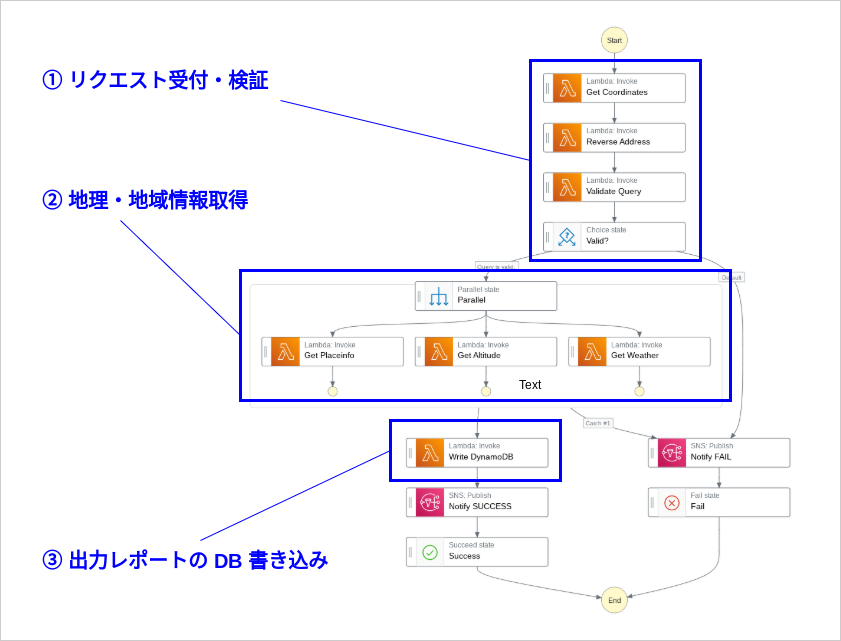
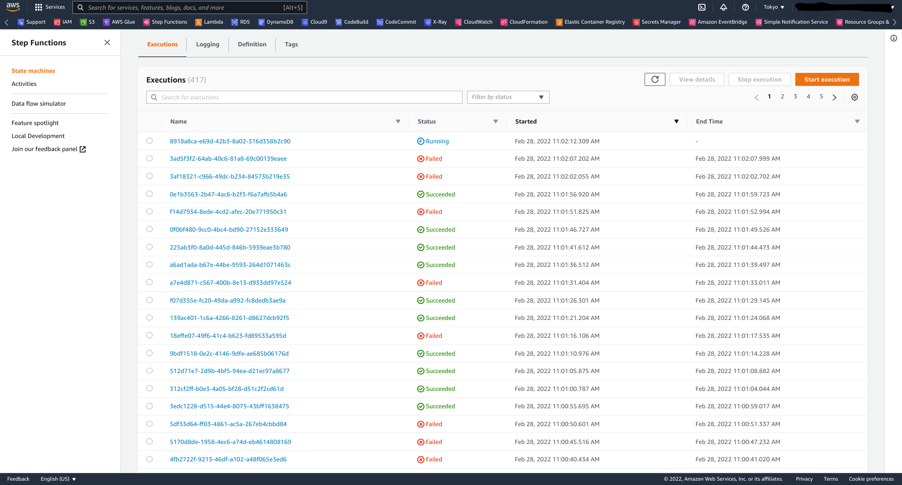
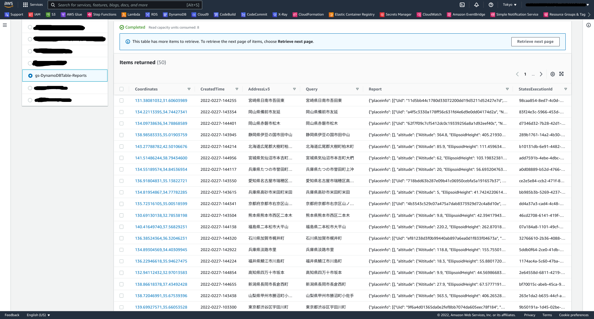
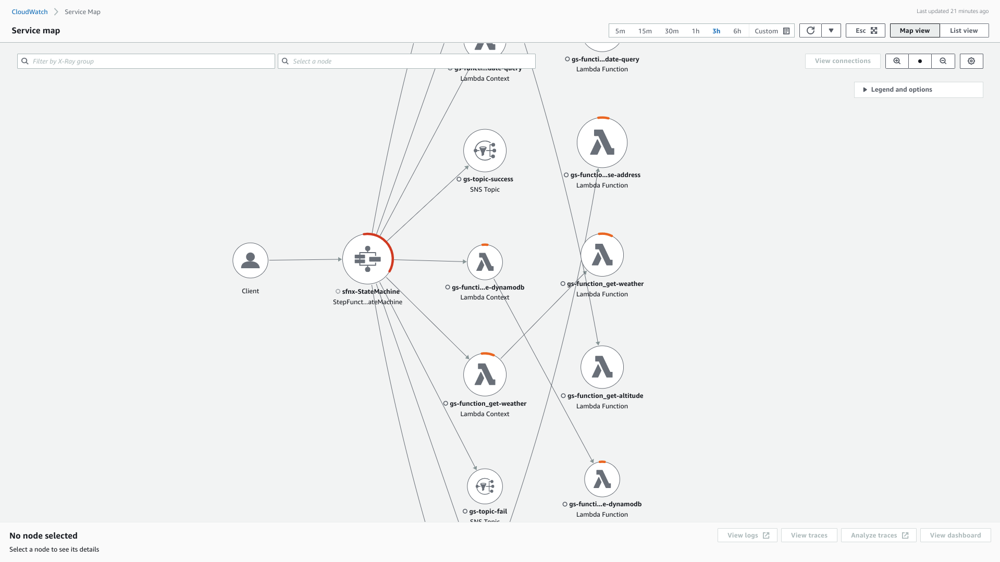
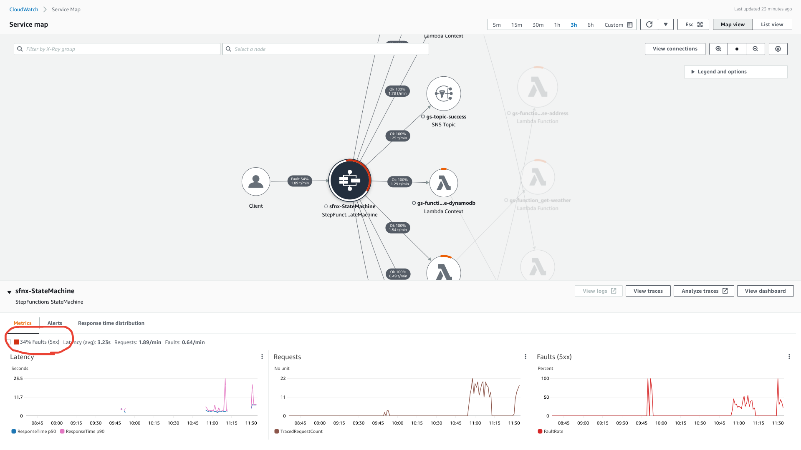
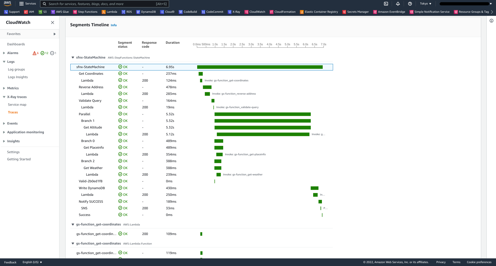
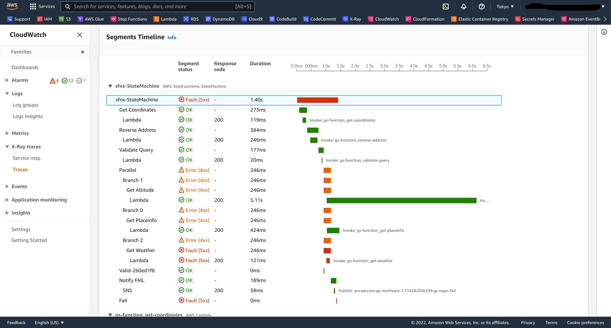

AWS アプリケーションの実行状態を X-Ray で可視化する
======================================================

# はじめに

## a. 記事概要

**解説すること**

* AWS X-Ray を使用してアプリケーションの可用性や性能をモニタリングし、そのボトルネックを特定します。

**解説しないこと**

* 記事執筆にあたり開発したデモアプリケーションの開発手順 (仕様・挙動の説明のみ)
* X-Ray サービスそのもののについての解説

## b. 想定読者

* X-Ray を利用した AWS アプリケーションのモニタリングについて知りたい方

## c. リソース

本記事で使用するリソースは、GitHub に公開しています。

* [roki18d / aws-sfnx_geo-search | GitHub](https://github.com/roki18d/aws-sfnx_geo-search)


# 1. デモアプリケーション概要

本章では、X-Ray 検証用に開発したデモアプリケーションの概要について解説します。



## 実現したいこと

例えば「東京都渋谷区宇田川町２丁目」のような住所文字列を入力として、その住所の「周辺施設情報」「地理高度情報」「天気情報」を取得し、これを出力として DB に書き込みます。

## 入力

アプリケーション全体のオーケストレーションは Step Functions (SFN) で実装しており、アプリケーションへの入力は SFN ステートマシンへの実行入力です。入力フォーマットを以下のように定義しています。クエリ (query) に指定する文字列は、日本の都道府県から大字以降までの住所文字列を想定しています。

```json
{
  "query": "東京都渋谷区宇田川",
  "config": {
    "skip": {
      "get-placeinfo": false,
      "get-altitude": false,
      "get-weather": false
    },
    "pause": {
      "get-placeinfo": 0,
      "get-altitude": 1,
      "get-weather": 0
    },
    "intentional_error_ratio": {
      "get-altitude": 0,
      "get-coordinates": 0,
      "get-placeinfo": 0.2,
      "get-weather": 0.1,
      "reverse-address": 0.05,
      "validate-query": 0,
      "write-dynamodb": 0.05
    }
  },
  "function_arns": "[{key: value}, ...]",
  "topic_arns": "[{key: value}, ...]"
}
```

## 出力

Yahoo! API で取得した「周辺施設情報」「地理高度情報」「天気情報」のレポートを、以下のような JSON に整形してこれを出力とします。

```json
{
    "placeinfo": [
        {
            "Uid": "8c086a2710991c548b6ee0d3e03c1f4c72d5ff00",
            "Name": "モスバーガー渋谷公園通り店",
            "Score": 119.8505458031217
        },
        "$comment": "(...省略...)", 
        {
            "Uid": "7ef168cdafd1f003b1febb753b45227dd5f35b81",
            "Name": "渋谷区役所前交差点",
            "Score": 48.56657142571379
        }
    ],
    "altitude": {
        "Altitude": 32.2,
        "EllipsoidHeight": 68.962682068807,
        "GeoidHeight": 36.762682068807
    },
    "weather": [
        {
            "Type": "observation",
            "Date": "2022-0228-0840",
            "Rainfall": 0
        },
        "$comment": "(...省略...)", 
        {
            "Type": "forecast",
            "Date": "2022-0228-1040",
            "Rainfall": 0
        }
    ]
}
```


## 機能

各機能は Lambda 関数で実現しており、各 Lambda 関数の中で Yahoo! が提供する [地図・地域情報 API](https://developer.yahoo.co.jp/webapi/map/) を使用しています。

### ① リクエスト受付・検証

まず、入力の "query" を入力として緯度・経度を取得 (Get Coordinates) します。取得した緯度・経度をそのまま各 API への入力にできれば良いですが、適当な入力クエリ文字列に対しても意図しない結果が返ってきてしまうことがあります。例えば "hoge" を入力とすると、「千葉県勝浦市」の住所の緯度・経度が返ってきました。

そこで、緯度・経度をもとに住所情報を逆引き (Reverse Address) し、この結果と入力クエリ文字列が前方一致するかどうかを検証 (Validate Query) することで、入力クエリ文字列の妥当性の確認とします。妥当性検証結果を SFN ステートマシンの JSON Path に書き込み、それを参照することで処理を継続するか、失敗として終了するかを判断します。


### ② 地理・地域情報取得

緯度・経度を入力として、各種地理・地域情報を取得します。取得する対象は何でも良いのですが、今回は Yahoo! API で取得できそうだった「周辺施設情報」「地理高度情報」「天気情報」の３つとしました。


### ③ 出力レポートの DB 書き込み

取得した各種地理・地域情報をレポートとして整形し、DynamoDB テーブルに書き込みます。スキーマは以下のようにしました。

* **Partition Key** ... "Coordinates" : 緯度・経度
* **Sort Key** ... "CreatedTime" : 作成時刻
* **Global Secondary Index** ... "AddressLv3" : 大字までの住所

## その他

X-Ray の挙動を確認するため、以下のような仕組みを取り込みました。

### A. Pause

地理・地域情報取得の Lambda 関数に対して、指定した時間だけ処理を停止します。意図としては、あえて特定の Lambda 関数の処理に時間をかけさせることで、アプリケーション全体の性能ボトルネックを分かりやすくするためです。

各 Lambda 関数に指定する停止時間は、SFN ステートマシン実行入力の `config.pause` で指定します。

### B. Intentional Error

各 Lambda 関数に対して、それぞれ指定した頻度でランダムにエラーを発生させます。意図としては、あえて各 Lambda 関数の実行を一定割合で失敗させることで、アプリケーション全体の可用性ボトルネックを分かりやすくするためです。

もちろん本来のエラーも起こりうるため、意図的に発生させるエラーを `IntentionalError`, そうでないものを `UnexpectedError`としてカスタム例外を定義しておきます。

各 Lambda 関数に指定する Intentional Error 発生頻度は、SFN ステートマシン実行入力の `config.intentional_ratio` で指定します。

# 2. デモアプリケーションの挙動確認

実在する大字までの住所を 200 件ほどランダム生成し、リスト化します。これらを入力クエリ文字列として実行入力に格納し、for 文でSFN ステートマシンを実行していきます。


Step Functions のマネジメントコンソールでステートマシンの実行一覧を確認できます。成功・失敗とも一定数存在し、失敗の中身を見てみると Intentional Error の他、入力クエリ住所と逆引き住所の不一致が目立ちます。（例: 入力「新潟県三島郡出雲崎町大寺」、逆引き「新潟県三島郡出雲崎町大字大寺」）



SFN ステートマシン実行結果が DynamoDB テーブルに正常に書き込まれています。




# 3. X-Ray によるモニタリング

## 3-1. Service Map

X-Ray Tracing が有効化されている場合、Service Map を表示させることができます。クライアントから SFN ステートマシンを実行しており、それが各 Lambda 関数を呼び出していることが分かります。エラーの割合はサーバーサイドエラーを赤色で、クライアントサイドエラーをオレンジ色で各ノードを円周上に表現されています。



ノードを選択すると、より詳細な情報にアクセスできます。SFN ステートマシンでは 34% の割合でサーバーサイドエラーを起こしているようです。



## 3-2. Tracing

SFN ステートマシン実行のうち、成功したもののトレースを見てみます。基本的には同期的に処理が進んでおり、地理・地域情報取得の部分は、ステートマシン定義通り並列で実行されています。「高度情報」取得のみ、5秒間の一時停止を設定しましたが、やはり性能ボトルネックになっていることがトレースから分かります。



以下は失敗したステートマシン実行のトレースです。




# さいごに


---
EOF
